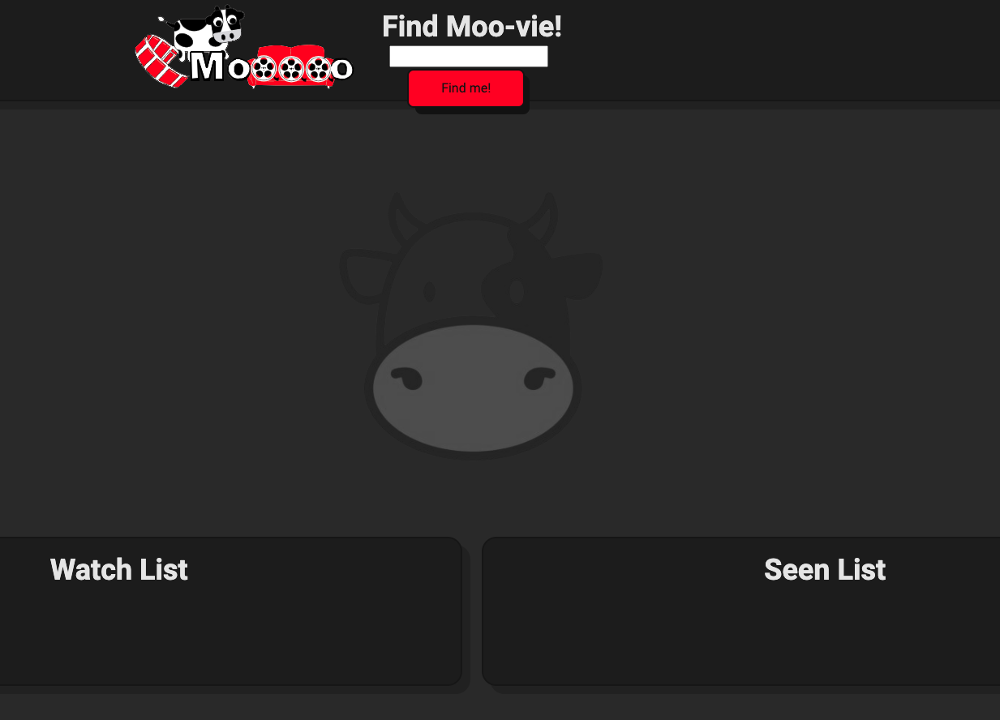
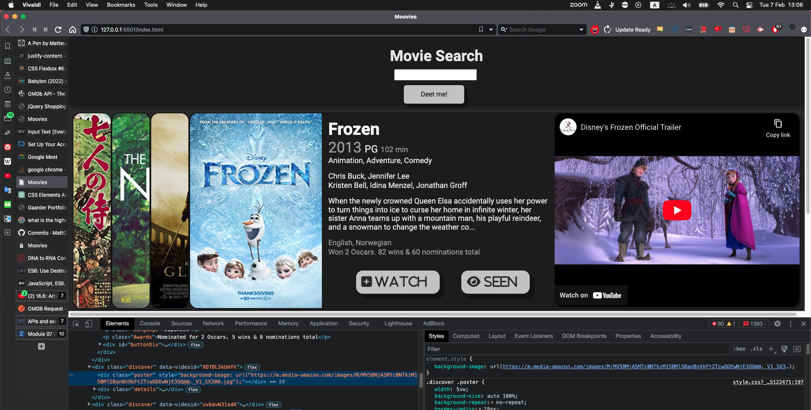
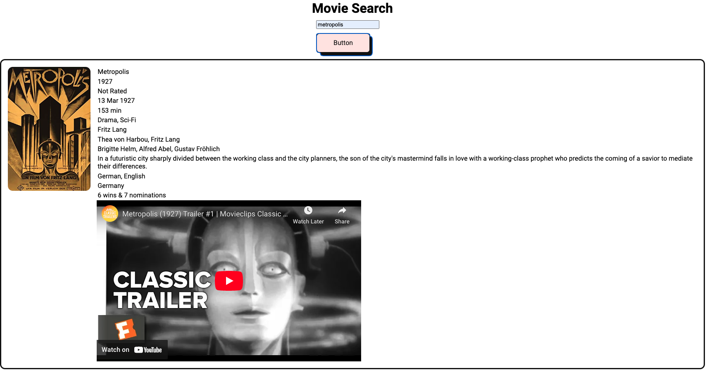

### moovie-search
A film comparison website where a user can add and compare films they are debating watching, and add them to a watch or seen list for later.

URL: https://mattgaarder.github.io/moovie-search/

## Challenges
- Getting the website and its dynamic elements responsive to different screen sizes.

## Success 
- Making calls to the OMDb and Youtube APIs. I was able to embed elements and aesthetically present data from API calls on the page.
- Dynamic elements that change based on the users behaviour.
- Actions like "move from watch to seen" are persisted in local storage and generate elements from saved data. 

## Built-with

- HTML5 markup
- Dynamic CSS properties
- Flexbox
- jQuery
- Youtube iframe element 
- OMDb and Youtube APIs

## Screenshots of early development and final product

Screenshot of page without .discover divs.



Screenshot of wider screen view with .discover divs. Note that each movie poster can be clicked on to scroll and transform on user input.



Screenshot of early stages of development.



## My favorite code from the project 

In this code I am using an object from a call to the OMDB API server to generate a list of html elements and populating them with the data from this object. I am avoiding unwanted data with logic, and I am giving them a class name corresponding to the key property of the object. I am doing this to apply css attributes, and later to use these applied classes to trigger functions that change the size or properties of the element. I am send this object as an argument to various functions that will display the corresonding video in an iframe element, or move the chosen movie to the watch or seen list.

```js
function displayInfo(OMDBCall) {
    playerDiv = $("<div id='player'>");
    buttonDiv = $("<div id='buttonDiv'>");
    deleteDiv = $("<div id='deleteDiv'>")
    discoverDiv = $("<div class='discover'>");
    posterDiv = $("<div class='poster'>");
    seenButton = $("<i id='seen' class='fa-solid fa-eye'></i>")
    watchButton = $("<i id='watch' class='fa-solid fa-square-plus'></i>");
    deleteBtn = $("<i class='fa-solid fa-circle-xmark'></i>");
    deleteBtn.addClass("delete-item-btn")
    seenButton.text(" Seen");
    watchButton.text(" Watch");
    detailsDiv = $("<div class='details'>");
    moviesView.append(discoverDiv);
    const keys = Object.keys(OMDBCall);
    let i = 0;
    for (const key of keys) {
        if (i === 13) break;
        if (i === 3 || i === 7 || i === 11) {
            i++;
            continue;
        }
        var theDeets = $("<p>").text(OMDBCall[key]).addClass(key);
        detailsDiv.append(theDeets);
        i++;
    }
    var imageURL = OMDBCall.Poster;
    $(".discover").children("#player").remove();
    $(".discover").children("iframe").remove();
    $(".poster").removeClass("active");
    $(".discover").removeClass("active");
    $(".details").removeClass("active");

    discoverDiv.addClass("active");
    detailsDiv.addClass("active");
    posterDiv.addClass("active");
    posterDiv.css("background-image", "url(" + imageURL + ")");
    deleteDiv.append(deleteBtn);
    
    discoverDiv.append(posterDiv);
    discoverDiv.append(detailsDiv);

    discoverDiv.prepend(deleteDiv);
    movieObject = {
        Title: OMDBCall.Title,
        Year: OMDBCall.Year,
        Poster: OMDBCall.Poster,
    };
    getTrailer(movieObject);
    seenButton.on('click', function () {
        moveToList(OMDBCall, 'seen');
    });
    watchButton.on('click', function () {
        moveToList(OMDBCall, 'watch');
    });
    discoverActivePWidth();
};
```

This funcion shows use of JSON.stringify and use of local storage.

```js
function moveToList(movieObject, list) {
    var listArray = JSON.parse(localStorage.getItem(list + "Array")) || [];
    for (var i = 0; i < listArray.length; i++) {
        if (movieObject.Title === listArray[i].Title) {
            return;
        }
    }
    clearArray(list === 'seen' ? seenList : watchList);
    listArray.push(movieObject);
    localStorage.setItem(list + "Array", JSON.stringify(listArray));
    if (list === 'seen') {
        createSeenArray();
    } else {
        createWatchArray();
    }
    watchListHeight();
    seenListHeight();
}
```

## Acknowledgments

Thank you Anna Bessant, Milda Jancauskaite. This page started as a group project, and I have made a new repository because I wanted to continue tinkering with the page, and as a milestone want to leave the original repository untouched. 